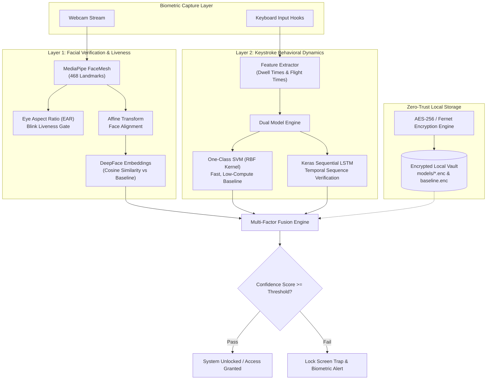

# 🛡️ Cadence: Dual-Layer Biometric Security Core

> **Localized, offline multi-modal biometric authentication combining real-time Facial Verification & Liveness Detection with Keystroke Behavioral Dynamics.**

---

## 📌 System Architecture



---

## ⚙️ Key Technical Components

### 1. Facial Recognition & Liveness Detection (`core_ai/face_ai.py`)
* **Liveness Detection**: Implements Eye Aspect Ratio (EAR) calculation using 6 landmark coordinate pairs per eye via **MediaPipe FaceMesh** to neutralize 2D static spoofing attacks (printed photos and screen replays).
* **Face Normalization**: Computes eye-center angles and applies an affine warp transform (`cv2.warpAffine`) to ensure pose-invariant facial embeddings.
* **Identity Verification**: Generates facial feature embeddings using **DeepFace** (supporting MTCNN and RetinaFace backends) and evaluates matches using cosine distance against encrypted user baselines.

### 2. Keystroke Behavioral Dynamics (`core_ai/keystroke_ai.py`)
* **Temporal Feature Extraction**: Captures key-down and key-up timestamp telemetry, extracting inter-key latency (Flight Time) and key-press duration (Dwell Time).
* **Dual-Model Verification**:
  * **Quick Mode (One-Class SVM)**: Configured with an RBF kernel ($\nu = 0.05$) and `StandardScaler` to handle typing variance with ultra-low latency, running smoothly on machines without AVX2 CPU extensions.
  * **Deep Mode (Keras LSTM)**: A 2-layer sequential LSTM network ($64 \rightarrow 32$ units with dropout) trained to capture temporal rhythms and subtle sequential typing cadences.

### 3. Encrypted Local Storage (`database/db_manager.py`)
* Biometric templates, facial baselines, and model weights are encrypted at rest using Fernet authenticated cryptography (AES-128-CBC + HMAC-SHA256) with salted PBKDF2 key derivation (100,000 iterations), ensuring encrypted local storage of sensitive biometric profiles.

---

## 🚀 Quick Start Guide

### Prerequisites
* **Python 3.10, 3.11, or 3.12**
* Webcam for facial enrollment and verification

### 1. Clone the Repository
```bash
git clone https://github.com/sanidhyaagrawal17/cadence-A-new-approach-to-biometric-security.git
cd cadence-A-new-approach-to-biometric-security
```

### 2. Create and Activate Virtual Environment
```bash
# Windows
python -m venv venv
venv\Scripts\activate

# Linux / macOS
python3 -m venv venv
source venv/bin/activate
```

### 3. Install Dependencies
```bash
python -m pip install --upgrade pip
pip install -r requirements.txt
```

### 4. Run the Application
```bash
python main.py
```
*(Or double-click `run_app.bat` on Windows)*

---

## 👥 Contributors (College Project — Team of 4)

* **Sanidhya Agrawal** — Core AI Architecture, Keystroke Dynamics Engine (SVM & LSTM Pipelines), Model Encryption & Database Vault
* **Sanskar Tolani** — Face Recognition Integration & Camera Hardware Hooks
* **Sakshi Sharma** — Security Protocols & Data Storage
* **Sakshi Rajput** — Frontend UI & User Interaction Flows
